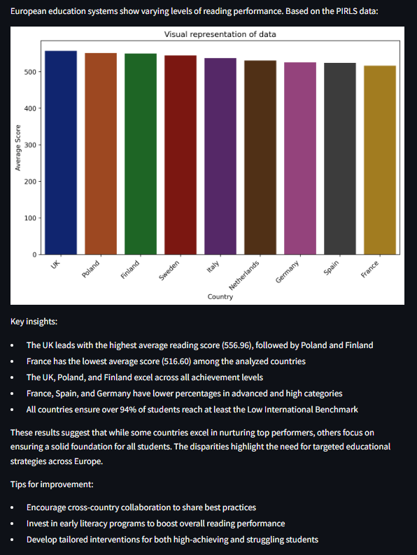

# Global Data Science Challenge (GDSC) 7 - LearningVoyager
---
## GenAI Assistant for Policymakers and Practitioners

## Table of Contents

- [Project Overview](#project-overview)
- [Solution Details](#solution-details)
- [Architecture](#architecture)
  - [Data Translation and Analysis Agent - PostgreSQL Engineer](#data-translation-and-analysis-agent---postgresql-engineer)
  - [Insight Synthesis and Visualization Agent - Education Expert](#insight-synthesis-and-visualization-agent---education-expert)
- [Technologies Used](#technologies-used)
- [Project Structure](#project-structure)
- [Installation](#installation)
- [Author](#author)


## Project Overview

This project was developed as part of the [Capgemini Global Data Science Challenge (GDSC)](https://gdsc.ce.capgemini.com), an internal hackathon dedicated to creating a GenAI assistant to support policymakers and practitioners in enhancing children's literacy worldwide. Using the Progress in International Reading Literacy Study (PIRLS) dataset, this GenAI assistant empowers decision-makers by providing actionable data insights aimed at improving reading and writing skills among young learners.

The solution is built on an agentic architecture deployed on AWS, leveraging the Sonnet large language model (LLM). The GenAI assistant operates through two core agents:

- **Data Translation and Analysis Agent**: Converts user queries into SQL commands to extract and analyze data from the PIRLS dataset and additional source.
- **Insight Synthesis and Visualization Agent**: Processes and synthesizes the data into accessible, actionable insights, generating visualizations as needed.

## Solution Details

### Architecture

The solution is composed of two main agents that collaborate to produce data-driven insights:

1. **Data Translation and Analysis Agent - PostgreSQL Engineer**
   - **Function**: Interprets user inputs, formulates and suggests relevant PostgreSQL queries, and executes them on the PIRLS dataset.
   - **Data Preparation**: Analyzes and structures data for easy interpretation, passing it to the Insight Synthesis Agent.
  
   - **Tools used**:
     - Querying database (query_database): Executes database queries to retrieve and prepare data insights.
     - Evaluating SQL Code (eval_sql_code): Evaluates SQL expressions for efficient query formation.
     - Gathering GDP data (gather_gdp_data): When needed gathers additional information about GDP of countries from gdp_data variable (data from World Bank).

2. **Insight Synthesis and Visualization Agent - Education Expert**
   - **Function**: Receives processed data, synthesizes it into clear answers, and generates visualizations to enhance understanding when necessary.
   - **Output**: Provides insightful summaries that inform decision-making for policymakers, making complex information easily accessible.
  
   - **Tools used**:
      - Visualization (visualization): Using Seaborn library, creates graphical representations (bar charts/scatter plots/line charts) of data insights when multiple data points are available. Then saving them as png file in S3 AWS bucket and returning link to file in final answer.

### Technologies Used

- **Language Model**: Claude 3.5 Sonnet for generating and refining language-based responses.
- **Database**: PostgreSQL for querying and managing the PIRLS dataset.
- **Cloud Platform**: AWS for scalable deployment and efficient data processing.
- **Data Visualization**: Seaborn library for creating graphical representations of data insights.

## Project Structure

```
├── img/
│   └── response_example.png    # Example of a response with visualization  
├── src/
│   ├── static/
│   │   ├── util.py
│   │   ├── submission.py
│   │   ├── ChatBedrockWrapper.py
│   │   ├── app.py
│   │   └── __init__.py
│   └── submission/
│       ├── crews/ 
│       │   ├── learningVoyager.py    # Defines core agents (PostgreSQL Engineer and Education Expert), their tasks, and tools used 
│       │   └── __init__.py     
│       ├── tools/
│       │   ├── database.py         # Tool for quering PostgreSQL database and returning the result
│       │   ├── eval_sql_code.py    # Tool for evaluating PostgreSQL code and returning the result
│       │   ├── visualization.py    # Tool for creating visualization, based on Seaborn library
│       │   ├── gather_gdp_data.py  # Tool for gathering additional data about GDP of countries
│       │   └── __init__.py        
│       ├── create_submission.py  
│       └── __init__.py
├── requirements.txt          # Python dependencies
└── README.md                 # Project documentation
```
### Installation
*Note: Requires AWS and PIRLS 2021 Database credentials*
 
*Installing the necessary libraries*
```
!pip install crewai -r requirements.txt
```
*Load modules*
```
import dotenv

from src.static.ChatBedrockWrapper import ChatBedrockWrapper
from src.static.submission import Submission
from src.submission.crews.learningVoyager import learningVoyager

dotenv.load_dotenv()
```

*Setting up the LLM and Agents*
```
model_id = "anthropic.claude-3-5-sonnet-20240620-v1:0"
    llm = ChatBedrockWrapper(model_id='anthropic.claude-3-5-sonnet-20240620-v1:0', model_kwargs={'temperature': 0}, call_id=call_id)
    crew = learningVoyager(llm=llm)
```
*Prompt the model*
```
question = "Could you give me most important insights about scores of different european education systems?"
answer = crew.run(question)
```
*Response example*



---

With this assistant, aim is to make literacy data insights more accessible, enabling policymakers to make data-driven decisions that enhance the learning experiences of children worldwide.

### Author
   - Maciej Twardowski ([maciej.twardowski@capgemini.com](maciej.twardowski@capgemini.com))
